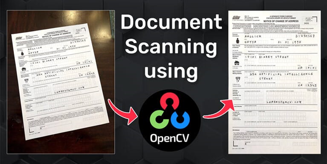
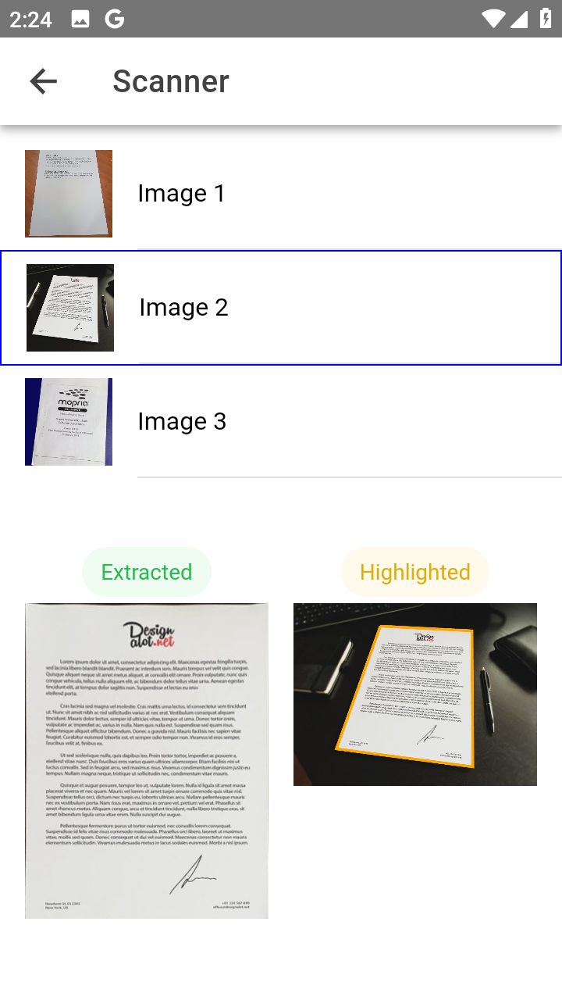

# ionvue-document-scanner

Document Scanner app like MS Lens using Ionic Vue and Capacitor

> Ionic Vue (Vite) project for **MS Lens** clone app using `opencv.js`

## Prerequisites

```yaml
node.js: 18.17.1
npm: 9.6.7

ionic/cli: 7.2.0
capacitor/cli: 6.1.2
```

## Getting Started

```bash
# install dependencies
$ npm install
# vite --host 0.0.0.0
$ npm run dev

# CAUTION!
# Be aware of running `ionic serve` as it might cause blue screen fatal error on your laptop
```

Visit http://localhost:5173/ for **Vite** dev server

## Build Mobile Platforms

```bash
# build
## vue-tsc && vite build
$ npm run build

# copy build
$ ionic cap copy

# IF native portion is updated, THEN sync
$ ionic cap sync
```

### Android

```bash
# live reload
$ ionic cap run android -l --external

$ cd android

$ gradlew clean

# build Android DEBUG apk
$ gradlew assembleDebug

# build Android RELEASE apk
$ gradlew assembleRelease
```





&copy; 2024 codeguru, All Rights Reserved.
